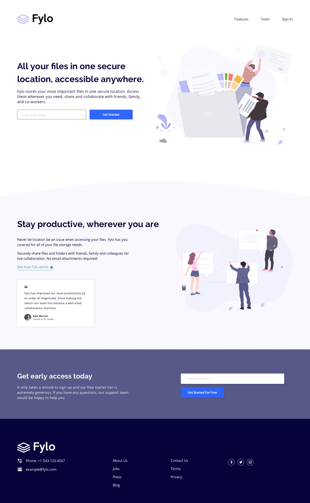
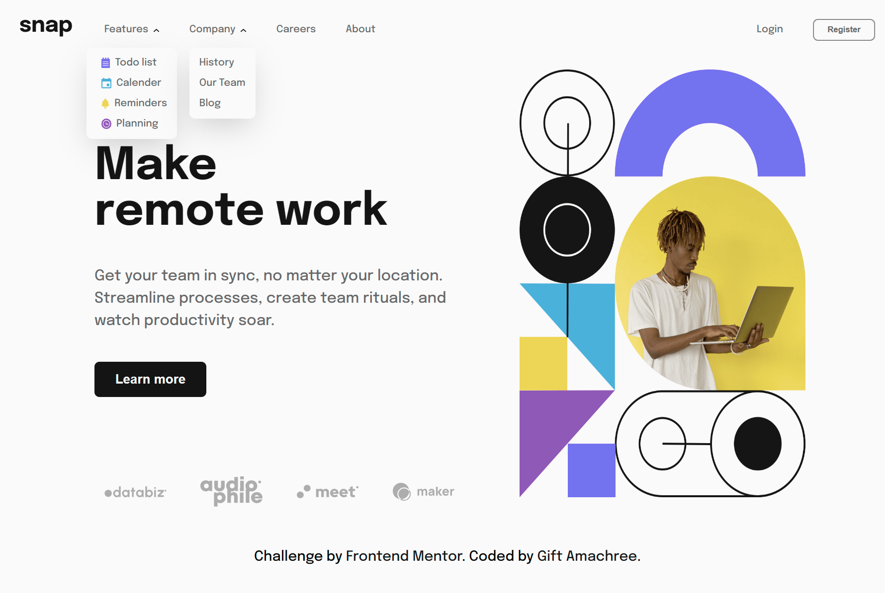
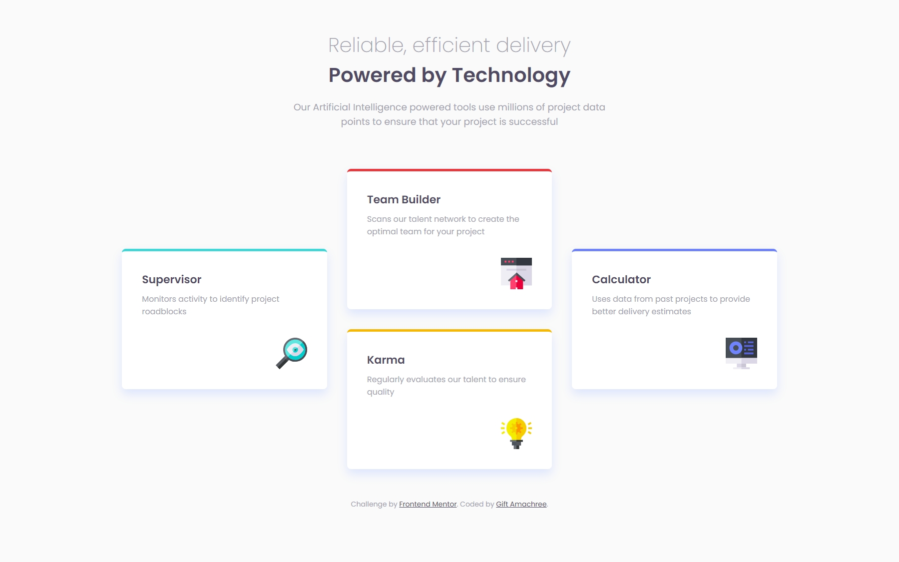
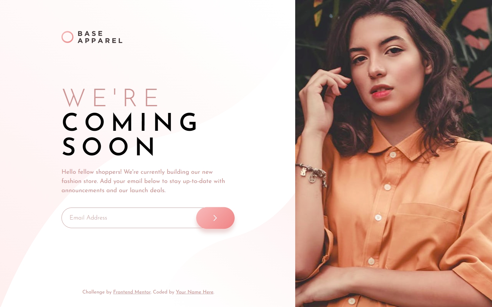
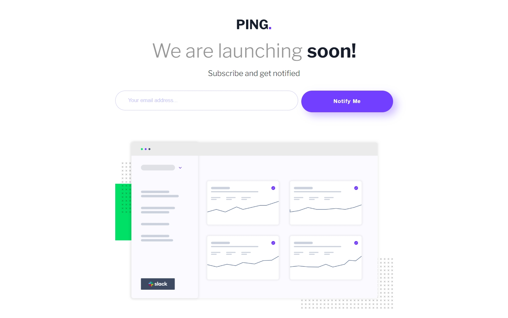
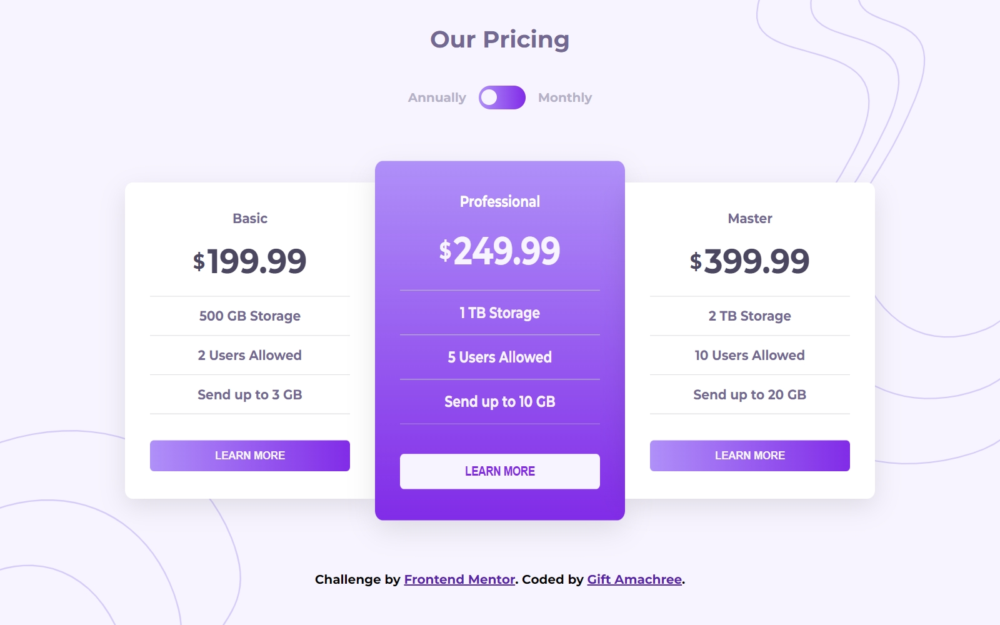
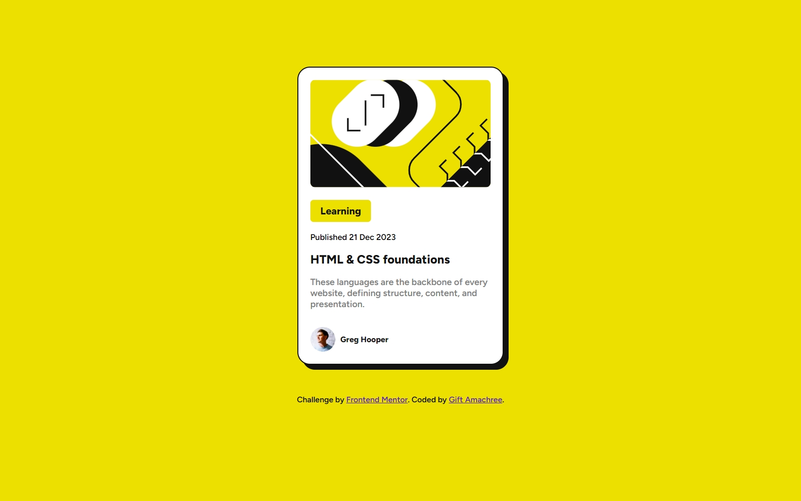

# This repository contains some of the tasks I have completed on Frontendmentor.io platform

## Table of Contents

- [This repository contains some of the tasks I have completed on Frontendmentor.io platform](#this-repository-contains-some-of-the-tasks-i-have-completed-on-frontendmentorio-platform)
  - [Table of Contents](#table-of-contents)
  - [Interactive-rating-component](#interactive-rating-component)
  - [Tip-calculator](#tip-calculator)
  - [fylo-landing-page](#fylo-landing-page)
  - [Drop-down-navigation](#drop-down-navigation)
  - [Faq-accordion1](#faq-accordion1)
  - [Faq-accordion2](#faq-accordion2)
  - [Four-card-feature-section](#four-card-feature-section)
  - [Base Apparel card](#base-apparel-card)
  - [Ping Coming soon page](#ping-coming-soon-page)
  - [Pricing component with toggle](#pricing-component-with-toggle)

## Interactive-rating-component

- Live Site URL: [live view](https://jen67.github.io/Frontendmentor-challenges/interactive-rating-component-main/index.html)

## Tip-calculator

- Live Site URL: [live view](https://tip-calculator-theta-drab.vercel.app/)

## fylo-landing-page

- Live Site URL: [live view](https://fylo-landing-page-lime-theta.vercel.app/)

## Drop-down-navigation

- Live Site URL: [live view](https://dropdown-nav-three.vercel.app/)

## Faq-accordion1

- Live Site URL: [live view](https://jen67.github.io/Frontendmentor-challenges/faq-accordion-card-main/)

## Faq-accordion2

- Live Site URL: [live view](https://jen67.github.io/Frontendmentor-challenges/faq-accordion-main/)

## Four-card-feature-section

- Live Site URL: [live view](https://jen67.github.io/Frontendmentor-challenges/four-card-feature-section)

## Base Apparel card 

- Live Site URL: [live view](https://jen67.github.io/Frontendmentor-challenges/base-apparel-coming-soon-master)

## Ping Coming soon page 

- Live Site URL: [live view](https://jen67.github.io/Frontendmentor-challenges/ping-coming-soon-page-master)

## Pricing component with toggle

- Live Site URL: [live view](https://jen67.github.io/Frontendmentor-challenges/pricing-component-with-toggle-master)

- Live Site URL: [live view](https://jen67.github.io/Frontendmentor-challenges/pricing-component-with-toggle-master)
