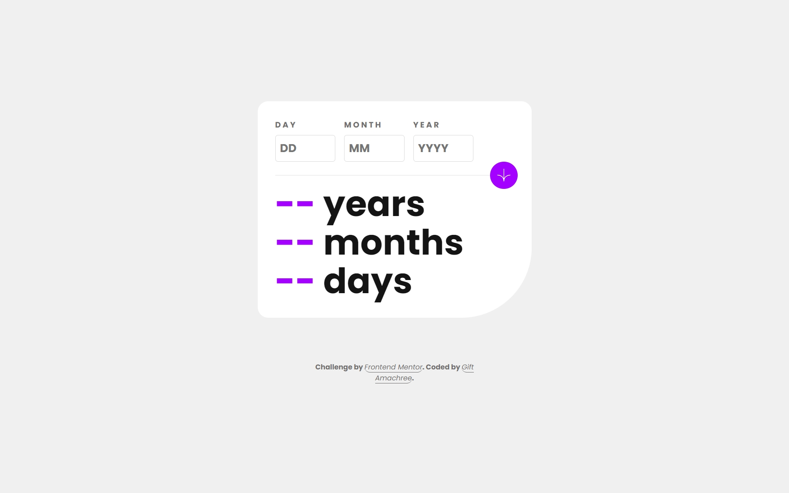

# Frontend Mentor - Age calculator app solution

This is a solution to the [Age calculator app challenge on Frontend Mentor](https://www.frontendmentor.io/challenges/age-calculator-app-dF9DFFpj-Q). Frontend Mentor challenges help you improve your coding skills by building realistic projects.

## Table of contents

- [Frontend Mentor - Age calculator app solution](#frontend-mentor---age-calculator-app-solution)
  - [Table of contents](#table-of-contents)
  - [Overview](#overview)
    - [The challenge](#the-challenge)
    - [Screenshot](#screenshot)
    - [Links](#links)
  - [My process](#my-process)
    - [Built with](#built-with)
    - [Continued development](#continued-development)
  - [Author 👩‍💻](#author-)

## Overview


### The challenge

Users should be able to:

- View an age in years, months, and days after submitting a valid date through the form
- Receive validation errors if:
  - Any field is empty when the form is submitted
  - The day number is not between 1-31
  - The month number is not between 1-12
  - The year is in the future
  - The date is invalid e.g. 31/04/1991 (there are 30 days in April)
- View the optimal layout for the interface depending on their device's screen size
- See hover and focus states for all interactive elements on the page
- **Bonus**: See the age numbers animate to their final number when the form is submitted

### Screenshot



### Links

- Solution URL: [Solution Url](https://github.com/jen67/Frontendmentor-challenges/tree/main/age-calculator-app-main)
- Live Site URL: [live site URL](https://jen67.github.io/Frontendmentor-challenges/age-calculator-app-main)

## My process

### Built with

- Semantic HTML5 markup
- CSS custom properties
- Flexbox
- javascript
- Mobile-first workflow

```js
//function to animate the value of an element

function animateValue(element, start, end, duration) {
    let current = start;
    let range = end - start;
    let increment = end > start ? 1 : -1;
    let stepTime = Math.abs(Math.floor(duration / range));
    let timer = setInterval(function () {
      current += increment;
      element.textContent = ` ${current}`;
      if (current == end) {
        clearInterval(timer);
      }
    }, stepTime);
  }

//implementing the animation

  animateValue(years, 0, ageInYears, 1000);
  animateValue(months, 0, ageInMonths, 1000);
  animateValue(days, 0, ageInDays, 1000);

```

### Continued development

I found implementing the age calculation a bit difficult so I am going to do more practice and tackle more challenges untill I am used to dealing with dates in javascript

## Author 👩‍💻

- Linkedin - [Gift Amachree](https://www.linkedin.com/in/gift-amachree-8a523623b/)
- Frontend Mentor - [@jen67](https://www.frontendmentor.io/profile/jen67)
- Twitter - [@JenniferAm96723](https://www.twitter.com/JenniferAm96723)
  
