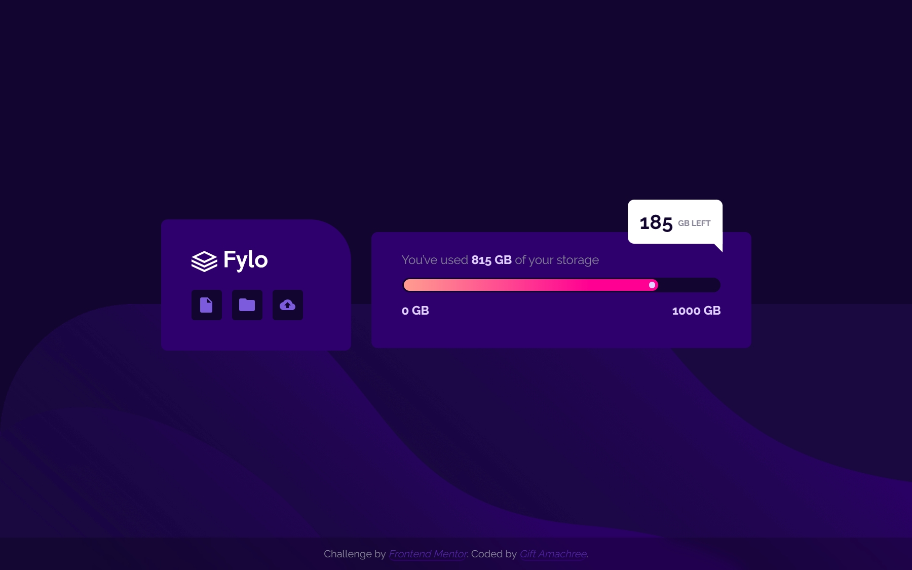

# Frontend Mentor - Fylo data storage component solution

This is a solution to the [Fylo data storage component challenge on Frontend Mentor](https://www.frontendmentor.io/challenges/fylo-data-storage-component-1dZPRbV5n). Frontend Mentor challenges help you improve your coding skills by building realistic projects.

## Table of contents

- [Frontend Mentor - Fylo data storage component solution](#frontend-mentor---fylo-data-storage-component-solution)
  - [Table of contents](#table-of-contents)
  - [Overview](#overview)
    - [The challenge](#the-challenge)
    - [Screenshot](#screenshot)
    - [Links](#links)
  - [My process](#my-process)
    - [Built with](#built-with)
  - [Author 👩‍💻](#author-)

## Overview

### The challenge

Users should be able to:

- View the optimal layout for the site depending on their device's screen size

### Screenshot

### Links

- Solution URL: [Solution Url](https://github.com/jen67/Frontendmentor-challenges/tree/main/fylo-data-storage-component-master)
- Live Site URL: [live site URL](https://jen67.github.io/Frontendmentor-challenges/fylo-data-storage-component-master)

## My process

### Built with

- Semantic HTML5 markup
- CSS custom properties
- Flexbox
- Mobile-first workflow

## Author 👩‍💻

- Linkedin - [Gift Amachree](https://www.linkedin.com/in/gift-amachree-8a523623b/)
- Frontend Mentor - [@jen67](https://www.frontendmentor.io/profile/jen67)
- Twitter - [@JenniferAm96723](https://www.twitter.com/JenniferAm96723)