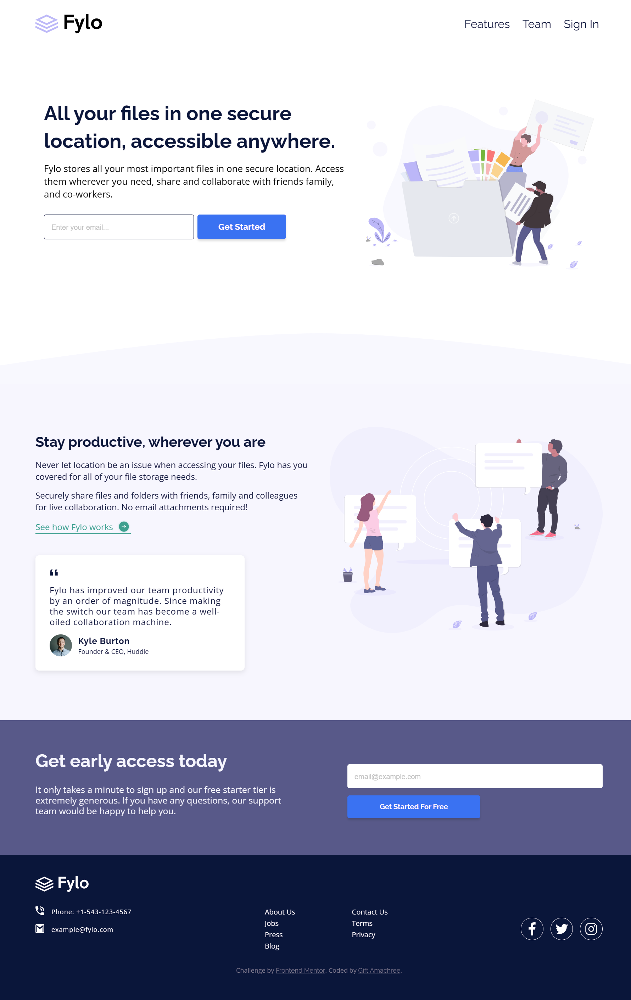

# Frontend Mentor - Fylo landing page with two column layout solution 🚀

This is a solution to the [Fylo landing page with two column layout challenge on Frontend Mentor](https://www.frontendmentor.io/challenges/fylo-landing-page-with-two-column-layout-5ca5ef041e82137ec91a50f5). Frontend Mentor challenges help you improve your coding skills by building realistic projects.

## Table of contents 📚

- [Frontend Mentor - Fylo landing page with two column layout solution 🚀](#frontend-mentor---fylo-landing-page-with-two-column-layout-solution-)
  - [Table of contents 📚](#table-of-contents-)
  - [Overview 🌐](#overview-)
    - [The challenge 💪](#the-challenge-)
    - [Screenshot 🖼️](#screenshot-️)
    - [Links 🔗](#links-)
  - [My process 🚀](#my-process-)
    - [Built with 🛠️](#built-with-️)
    - [Continued development 🌱](#continued-development-)
  - [Author 👩‍💻](#author-)

## Overview 🌐

### The challenge 💪

Users should be able to:

- View the optimal layout for the site depending on their device's screen size
- See hover states for all interactive elements on the page

### Screenshot 🖼️

### Links 🔗

- Solution URL: [My solution Url](https://github.com/jen67/Frontendmentor-challenges/tree/main/fylo-landing-page)
- Live Site URL: [Add live site URL here](https://your-live-site-url.com)

## My process 🚀

### Built with 🛠️

- Semantic HTML5 markup
- CSS custom properties
- Flexbox
- SCSS
- Mobile-first workflow

### Continued development 🌱

I look forward to practicing more and getting an internship position to help boost my skills more.

## Author 👩‍💻

- Linkedin - [Gift Amachree](https://www.linkedin.com/in/gift-amachree-8a523623b/)
- Frontend Mentor - [@jen67](https://www.frontendmentor.io/profile/jen67)
- Twitter - [@JenniferAm96723](https://www.twitter.com/JenniferAm96723)
